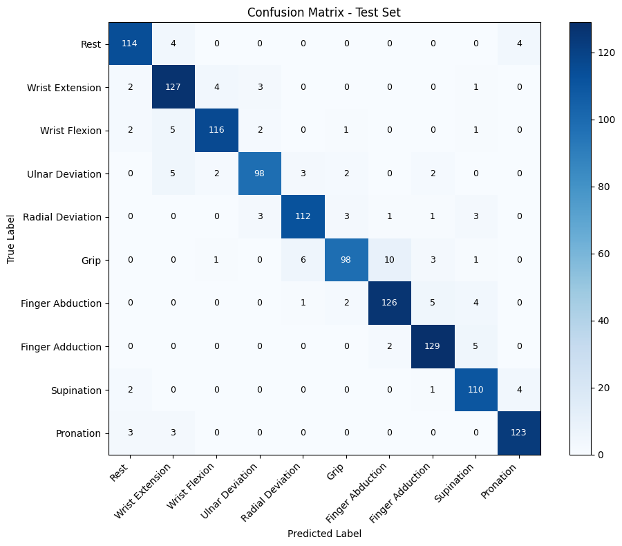

# High-Fidelity Bionic Arm for Transradial Amputees

A distributed, low-latency bionic prosthesis research platform intended for transradial amputees with approximately 5–10 cm of residual forearm.

The system combines custom multi-channel surface electromyography (sEMG) acquisition, deep-learning-based gesture recognition, geometric inverse kinematics, and real-time embedded motor control.

> **Current development scope:**  
> The first sEMG acquisition and gesture-recognition prototypes are being developed and validated using intact forearm signals. The long-term objective is to adapt and validate the system for transradial amputees.

---

## 🚀 System Architecture

The intended system uses a heterogeneous architecture split between a Raspberry Pi 5 central intelligence unit and an STM32H743VIT6 embedded controller. During early AFE development, an ESP32 is used as the prototype acquisition platform.

```text
Forearm muscle activity
        │
        ▼
Surface electrodes
        │
        ▼
Four-channel sEMG analog front end
        │
        ▼
ESP32 ADC and data streaming
Current prototype
        │
        ▼
Raspberry Pi 5
DSP, gesture recognition and inverse kinematics
        │
        ▼
STM32H743VIT6
Future embedded inference, actuation and safety control
        │
        ▼
Finger and thumb actuators
```

The Raspberry Pi 5 currently handles computationally intensive signal processing and model inference. The STM32H743VIT6 remains the intended real-time embedded controller, with future plans to port a compressed inference pipeline onto it while retaining deterministic motor control and safety monitoring.

---

## ⚡ Four-Channel sEMG Analog Front End

The project includes a custom four-channel sEMG analog front end built using locally available components.

The first prototype uses a discrete signal-conditioning chain based on LM358 and LM324 operational amplifiers.

### Electrode Configuration

Four bipolar channels are positioned over major forearm flexor and extensor regions.

| Channel | Approximate muscle region |
|---|---|
| Channel 1 | Extensor carpi ulnaris |
| Channel 2 | Flexor carpi ulnaris |
| Channel 3 | Extensor carpi radialis |
| Channel 4 | Flexor carpi radialis |

The full arrangement uses:

- 8 sensing electrodes
- 1 shared reference electrode
- 4 differential sEMG channels

### Per-Channel Signal Path

```text
Electrode pair
        │
        ▼
Input current limiting and RF filtering
        │
        ▼
Voltage buffers
LM358 / LM324
        │
        ▼
Discrete differential amplifier
LM358 / LM324
        │
        ▼
20 Hz high-pass filter
        │
        ▼
Adjustable gain stage
        │
        ▼
350–400 Hz low-pass filter
        │
        ▼
ESP32 ADC
```

### Initial Hardware Targets

| Parameter | Starting target |
|---|---:|
| Channels | 4 |
| First-stage gain | Approximately 4.7 |
| Second-stage gain | Approximately 11 |
| Total starting gain | Approximately 52 |
| High-pass cutoff | Approximately 20 Hz |
| Low-pass cutoff | Approximately 350–400 Hz |
| Sampling rate | 1–2 kS/s per channel |
| ADC | ESP32 internal ADC |
| Signal reference | Buffered 1.65 V |
| Supply | Battery-powered during human testing |

The gain will be increased only after checking for saturation, motion artefacts, noise, and ADC clipping.

For the complete AFE design and development plan, see:

[Four-Channel sEMG AFE Architecture](./docs/EMG_AFE_ARCHITECTURE.md)

---

## 🔌 ESP32 Acquisition Node

### Role

Initial four-channel sEMG acquisition, buffering, and streaming.

### Responsibilities

- Samples the four conditioned analog sEMG outputs.
- Maintains consistent channel ordering.
- Buffers multichannel samples.
- Streams data to a development computer or Raspberry Pi 5.
- Supports real-time visualization and data collection.
- Detects ADC clipping and saturation conditions.

The ESP32 internal ADC is used for the first prototype. An external ADC will be introduced only if measured performance shows that ADC non-linearity, noise, or channel consistency limits gesture classification.

---

## 🧠 Central Intelligence and Embedded Processing

### Raspberry Pi 5 — Current Central Intelligence Unit

The Raspberry Pi 5 currently performs the computationally intensive parts of the control pipeline.

#### Responsibilities

- Receives synchronized four-channel sEMG samples from the ESP32 prototype.
- Performs digital filtering, normalization, segmentation, and windowing.
- Executes time-domain and frequency-domain feature extraction.
- Runs the CNN-BiLSTM-Attention gesture-recognition pipeline.
- Computes geometric inverse kinematics.
- Converts spatial targets into desired joint-angle arrays.
- Sends gesture commands and target joint positions to the STM32H743VIT6.

### STM32H743VIT6 — Intended Embedded Intelligence Platform

The STM32H743VIT6 is the intended real-time embedded controller for the integrated prosthesis.

Its planned responsibilities include:

- Receiving conditioned sEMG data through its ADC or an external ADC.
- Running a compressed and hardware-optimized gesture-classification model in a future revision.
- Receiving high-level commands from the Raspberry Pi 5 during the current distributed implementation.
- Executing deterministic trajectory generation and low-level motor control.
- Monitoring actuator current, temperature, position limits, communication integrity, and emergency conditions.

> **Prototype note:** The current AFE prototype uses an ESP32 for ADC sampling and data streaming because it is readily available and convenient for early hardware validation. This does not replace the planned STM32H743VIT6 role in the final architecture.

---

## 🤖 Gesture-Recognition Pipeline

The current subject-dependent classification pipeline uses:

```text
Four-channel sEMG windows
        │
        ▼
Convolutional Neural Network
        │
        ▼
Bidirectional LSTM
        │
        ▼
Attention mechanism
        │
        ▼
Gesture classification
```

The CNN extracts local temporal features from the sEMG signals. The BiLSTM models temporal dependencies across each input window, while the attention mechanism emphasizes the most informative temporal features before classification.

### Target Gesture Set

The current pipeline predicts 10 gestures:

1. Rest
2. Wrist extension
3. Wrist flexion
4. Ulnar deviation
5. Radial deviation
6. Grip
7. Finger abduction
8. Finger adduction
9. Supination
10. Pronation

### Current Evaluation Results

- **Subject-Dependent, Intra-Subject:**  
  More than **91% classification accuracy** when trained and evaluated on data from an individual participant.

- **Subject-Dependent, Inter-Subject / Mixed-Population Evaluation:**  
  More than **54% classification accuracy** under the current mixed-population evaluation pipeline.

The current model serves as the development baseline. The longer-term objective is a robust subject-independent model capable of generalizing to unseen users with minimal recalibration.

### Dataset

The current experiments use the:

[Multi-Channel sEMG Hand Gesture Signal Dataset](https://www.kaggle.com/datasets/python16/multi-channel-semg-hand-gesture-signal-dataset)

### Notebooks

- [Subject-Dependent Intra-Subject Model](./Subject_Dependant_Intra_Subject/single.ipynb)
- [Subject-Dependent Inter-Subject Experiments](./Subject_Dependant_Inter_Subject/global_normalize.ipynb)
- [Subject-Independent Experiments](./Subject_Independent/)

### Evaluation Note

A true subject-independent evaluation requires the test participants to be completely excluded from the training and validation sets.

The final pipeline will therefore use subject-wise train, validation, and test splits to prevent participant-level data leakage.

---

## 📊 Gesture Recognition Performance

### Intra-Subject Confusion Matrix

The following confusion matrix shows the performance of the current subject-dependent intra-subject model on the selected participant's test set.



---

## ⚙️ Real-Time Actuation and Safety Control

The STM32H743VIT6 provides the real-time actuation layer of the intended system.

- Receives predicted gestures and target joint-angle arrays.
- Generates trapezoidal or S-curve motion profiles.
- Produces synchronized PWM outputs for finger and thumb actuators.
- Monitors current, temperature, position limits, and communication integrity.
- Enforces safe-state, watchdog, and emergency-stop behaviour.
- Provides the target platform for future compressed on-device inference.

During the current prototype stage, the ESP32 is used only for sEMG acquisition and streaming. The STM32H743VIT6 remains the planned controller for integrated actuation and future embedded intelligence.

---

## 🔄 Communication Architecture

The processing nodes communicate through local serial interfaces.

Candidate interfaces include:

- UART for early prototyping and debugging
- SPI for higher-throughput local communication
- USB serial for development-time streaming

Typical data flow:

```text
ESP32 → Raspberry Pi 5:
- Four-channel sEMG samples
- Sample counters or timestamps
- ADC clipping flags
- Acquisition status

Raspberry Pi 5 → STM32H743VIT6:
- Predicted gesture
- Classification confidence
- Target joint-angle array
- Motion mode
- Emergency or safe-state command
```

---

## 🛡️ Safety Architecture

The system must reject uncertain predictions rather than forcing every input window into a gesture.

```text
Model prediction
        │
        ▼
Confidence threshold
        │
        ├── Confident prediction → motion command
        │
        └── Low confidence → hold or return to safe state
```

Planned safety mechanisms include:

- Explicit rest state
- Prediction-confidence threshold
- Motor-current monitoring
- Thermal monitoring
- Joint-angle and velocity limits
- Communication timeout
- Watchdog timer
- Emergency stop
- Safe startup and shutdown states

### Human-Connected Electrical Safety

The analog front end must be battery-powered during human measurements.

Do not connect the user directly to:

- A non-isolated bench power supply
- A grounded desktop oscilloscope
- A mains-connected USB system without suitable isolation

Initial circuit validation should use simulated signals before electrodes are connected to a person.

This project is an engineering research prototype and is not a clinical or diagnostic medical device.

---

## 🛣️ Development Roadmap

### Phase 1 — Single-Channel AFE

- Build the buffer and differential-amplifier stages.
- Validate the circuit using a simulated low-amplitude signal.
- Add the high-pass, gain, and low-pass stages.
- Measure gain, bandwidth, output bias, noise, and clipping.

### Phase 2 — Four-Channel Acquisition

- Duplicate the validated channel.
- Build the four-channel soldered prototype.
- Implement ESP32 sampling and buffering.
- Stream synchronized data to a computer or Raspberry Pi 5.

### Phase 3 — Gesture Recognition

- Reproduce the subject-dependent baseline.
- Establish classical baselines using LDA and SVM.
- Validate subject-wise dataset splitting.
- Improve the CNN-BiLSTM-attention model.
- Develop subject-independent and transfer-learning approaches.

### Phase 4 — Embedded Optimization

- Evaluate external ADC integration if required.
- Apply pruning, quantization, and model compression.
- Compare Raspberry Pi and STM32 inference.
- Measure latency, memory use, accuracy, and power consumption.

### Phase 5 — Prosthetic Integration

- Map gestures to hand and wrist actions.
- Integrate trajectory generation and actuator control.
- Implement feedback and hardware safety systems.
- Perform structured intact-limb testing.
- Progress toward supervised testing for transradial amputees.

---

## 📁 Repository Structure

```text
.
├── Current_ESP_testing/
├── docs/
│   └── EMG_AFE_ARCHITECTURE.md
├── Firmware/
├── Images/
├── Subject_Dependant_Intra_Subject/
├── Subject_Dependant_Inter_Subject/
├── Subject_Independent/
├── .gitignore
├── count.py
├── label_filtered_csvs.py
├── LICENSE
├── README.md
└── survey_responses.xlsx
```

---

## 📌 Current Project Status

| Subsystem | Status |
|---|---|
| Target gesture set | Defined |
| Subject-dependent model | Implemented |
| Intra-subject evaluation | Completed |
| Mixed-population evaluation | Completed |
| Subject-independent evaluation | In progress |
| Electrode configuration | Defined |
| Single-channel AFE architecture | Defined |
| Single-channel hardware validation | In progress |
| Four-channel AFE prototype | Planned |
| ESP32 acquisition firmware | In progress |
| Raspberry Pi real-time pipeline | Planned |
| STM32 actuation firmware | Planned |
| Robotic-hand integration | Planned |

---

## License

See [LICENSE](./LICENSE).
