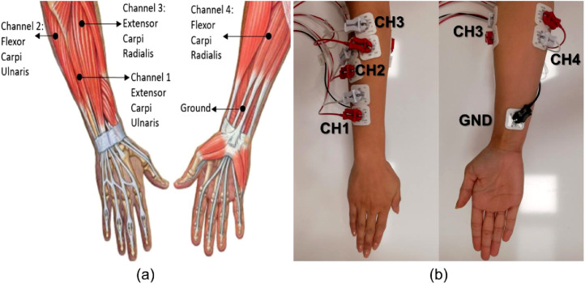

# Four-Channel sEMG AFE Architecture

## Overview

This project uses a custom four-channel surface electromyography (sEMG) analog front end to acquire forearm muscle activity for gesture recognition.

The first prototype is designed for intact-limb testing and uses locally available components that are easy to source, replace, and validate. The long-term goal is to adapt the system for transradial amputees.

---

## Electrode Configuration

The system uses four bipolar sEMG channels positioned over major forearm flexor and extensor regions.

| Channel | Approximate muscle region |
|---|---|
| 1 | Extensor carpi ulnaris |
| 2 | Flexor carpi ulnaris |
| 3 | Extensor carpi radialis |
| 4 | Flexor carpi radialis |

The complete setup uses:

- 8 sensing electrodes
- 1 shared reference electrode
- 4 differential channels



---

## Per-Channel Signal Path

```text
Electrode pair
        │
        ▼
Input current limiting and RF filtering
        │
        ▼
Voltage buffers
LM358 / LM324
        │
        ▼
Discrete differential amplifier
LM358 / LM324
        │
        ▼
20 Hz high-pass filter
        │
        ▼
Adjustable gain stage
        │
        ▼
350–400 Hz low-pass filter
        │
        ▼
ESP32 ADC
```

The same analog chain is repeated for all four channels.

---

## Starting Hardware

| Block | Initial choice |
|---|---|
| Input buffers | LM358 / LM324 |
| Differential amplifier | LM358 / LM324 |
| First-stage gain | Approximately 4.7 |
| High-pass filter | Approximately 20 Hz |
| Second-stage gain | Approximately 11 initially |
| Total starting gain | Approximately 52 |
| Low-pass filter | Approximately 350–400 Hz |
| ADC and controller | ESP32 |
| Sampling rate | 1–2 kS/s per channel |
| Signal reference | Buffered 1.65 V |
| Supply | Battery-powered during human testing |

The gain will be increased only after checking for saturation, noise, and motion artefacts.

---

## Why a Discrete AFE Is Used

Dedicated instrumentation amplifiers and EMG AFE modules are difficult and expensive to source locally.

The first prototype therefore uses common LM358 and LM324 op-amps to provide:

- High-input-impedance buffering
- Differential amplification
- Baseline-drift reduction
- Controlled gain
- Anti-alias filtering

A dedicated instrumentation amplifier or external ADC may be introduced later if testing shows that noise, offset, common-mode rejection, or ADC performance is insufficient.

---

## ESP32 Acquisition

The ESP32 will initially:

- Sample the four conditioned sEMG channels
- Maintain consistent channel ordering
- Buffer and stream the data
- Support real-time visualization
- Record data for gesture-classification experiments
- Detect clipping or ADC saturation

The ESP32 internal ADC is accepted as the starting solution. An external ADC will be added only if measured performance requires it.

---

## Development Plan

1. Build and test one complete channel.
2. Validate gain, bandwidth, noise, and output bias.
3. Record basic gestures such as rest, grip, flexion, and extension.
4. Adjust gain and filter values if required.
5. Duplicate the validated channel into a four-channel prototype.
6. Stream data using the ESP32.
7. Train and evaluate gesture-classification models.
8. Integrate gesture commands with the bionic hand.

---

## Safety

The human-connected circuit must be battery-powered.

Do not connect the user directly to:

- A non-isolated bench supply
- A grounded oscilloscope
- A mains-connected USB system without suitable isolation

The first tests should use simulated signals before electrodes are connected to a person.

This is an engineering research prototype and not a clinical medical device.
